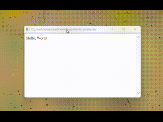
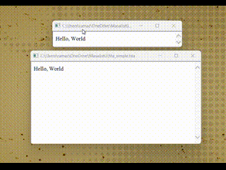
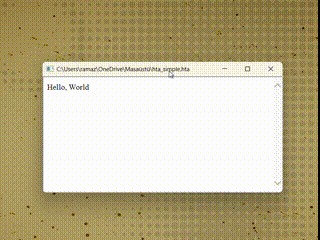

# AlwaysOnTopper

Simple Window Manager for Windows based on [AlwaysOnTopper by Alexey 'Cluster' Avdyukhin](https://github.com/ClusterM/AlwaysOnTopper).

# Features

* Adds 'Always on top' item to system menu of every window. (Supports " 🪟 + " Shortcut)
 

* Adds 'Transparency / Click-through' item to system menu of every window. It supports changing transparency level and set the "Click-through" mode of the window. (Supports " 🪟 + " Shortcut)

* In addition to the default 'Transparency / Click-through' features, it also includes live Windows Visual Styles editing support to set the window to Classic, Basic Theme (without DWM), or Aero (Default).

## How to use

Make sure that .NET Framework 4.5.2 is installed. Just run **AlwaysOnTopper.exe**. It's recommended to add this app to autorun.

## Original Author/contacts

**Alexey 'Cluster' Avdyukhin**

clusterrr@clusterrr.com

[https://github.com/ClusterM](https://github.com/ClusterM)

[http://clusterrr.com](http://clusterrr.com)

